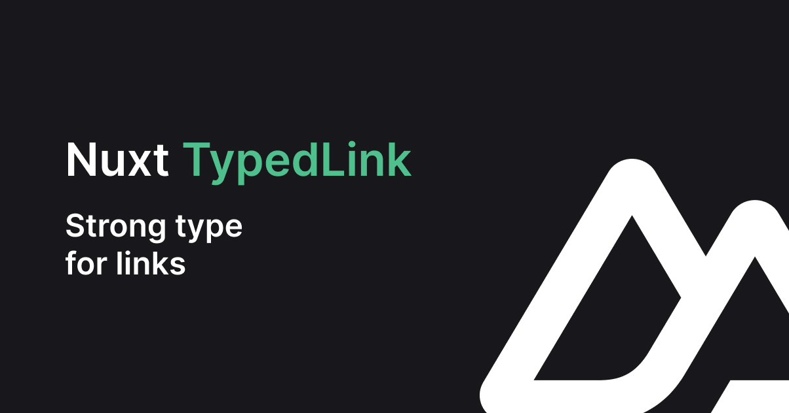

[](./docs/public/cover.jpg)

[![npm version][npm-version-src]][npm-version-href]
[![npm downloads][npm-downloads-src]][npm-downloads-href]
[![License][license-src]][license-href]
[![Nuxt][nuxt-version-src]][nuxt-version-href]


# SVG transformer

A **Nuxt 3** module to use `TypedLink` component with typed routes.

## Why

This module is heavy inspired by [nuxt-typed-router](https://github.com/victorgarciaesgi/nuxt-typed-router), you can use in your app too. Where `nuxt-typed-router` give a router typed, `nuxt-typed-link` give a new component `TypedLink` strongly typed.

## Features

- [**Nuxt 3**](https://nuxt.com) support
- 🔎 Vue component ready with `TypedLink`
- 🔥 Hot reloading when routes updated
- 🌏 Support i18n (<https://github.com/nuxt-modules/i18n>)
- ✅ Support `params`
- 🦾 Strongly typed, validate by `to` prop (`typescript` required)

## Installation

With `NPM`

```bash
npm install nuxt-typed-link -D
```

With `yarn`

```bash
yarn add nuxt-typed-link -D
```

Or `pnpm`

```bash
pnpm add nuxt-typed-link -D
```

## Usage

```ts
import { defineNuxtConfig } from 'nuxt/config'

export default defineNuxtConfig({
  modules: [
    'nuxt-typed-link',
  ],
  typedLink: {
    // ...
  },
})
```

| **Option**      | **Type**  | **Default** | **Description**                                                 |
| --------------- | --------- | ----------- | --------------------------------------------------------------- |
| `componentName` | `string`  | `TypedLink` | Override component name.                                        |
| `i18n`          | `boolean` | `false`     | i18n enabled, if you use <https://github.com/nuxt-modules/i18n> |

## Example

```bash
pages/
├── index.vue
├── about.vue
```

```vue
<template>
  <div>
    <TypedLink :to="{
      name: 'index',
    }">
      Home
    </TypedLink>
    <TypedLink :to="{
      name: 'abut', 
    }"> <!-- type error! -->
      About
    </TypedLink>
  </div>
</template>
```

## `TypedLink` Props

| **Prop** | **Type**    | **Required** | **Description** |
| -------- | ----------- | ------------ | --------------- |
| `to`     | `RouteType` | `true`       | Route object.   |

## Roadmap

- [ ] Support typed `query`
- [ ] Add type for composable `routes`

## 💻 Development

- Clone repository
- Install dependencies using `pnpm i`
- Prepare using `pnpm dev:prepare`
- Try playground using `pnpm dev`

### Local module

Create a `tgz`.

```bash
rm -f ~/nuxt-typed-link-*.tgz && npm pack && mv nuxt-typed-link-*.tgz ~/
```

Add it to your Nuxt app.

```json
{
  "devDependencies": {
    "nuxt-typed-link": "file:~/nuxt-typed-link-0.0.1.tgz"
  }
}
```

## More typescript in your app?

Try [nuxt-svg-transformer](https://github.com/kiwilan/nuxt-svg-transformer) to manage SVG as icons, transform SVG to inject dynamically into Vue component, type included.

## License

[MIT](./LICENSE) - Made with 💚

[](https://github.com/kiwilan)

[nuxt-version-src]: https://img.shields.io/static/v1?label=Nuxt&message=v3&color=28cf8d&logo=nuxt.js&logoColor=ffffff&labelColor=18181b
[nuxt-version-href]: https://npmjs.com/package/nuxt-typed-link

[npm-version-src]: https://img.shields.io/npm/v/nuxt-typed-link/latest.svg?style=flat&colorA=18181B&colorB=28CF8D
[npm-version-href]: https://npmjs.com/package/nuxt-typed-link

[npm-downloads-src]: https://img.shields.io/npm/dt/nuxt-typed-link.svg?style=flat&colorA=18181B&colorB=28CF8D
[npm-downloads-href]: https://npmjs.com/package/nuxt-typed-link

[license-src]: https://img.shields.io/github/license/kiwilan/nuxt-typed-link.svg?style=flat&colorA=18181B&colorB=28CF8D
[license-href]: https://github.com/kiwilan/nuxt-typed-link/blob/main/LICENSE
